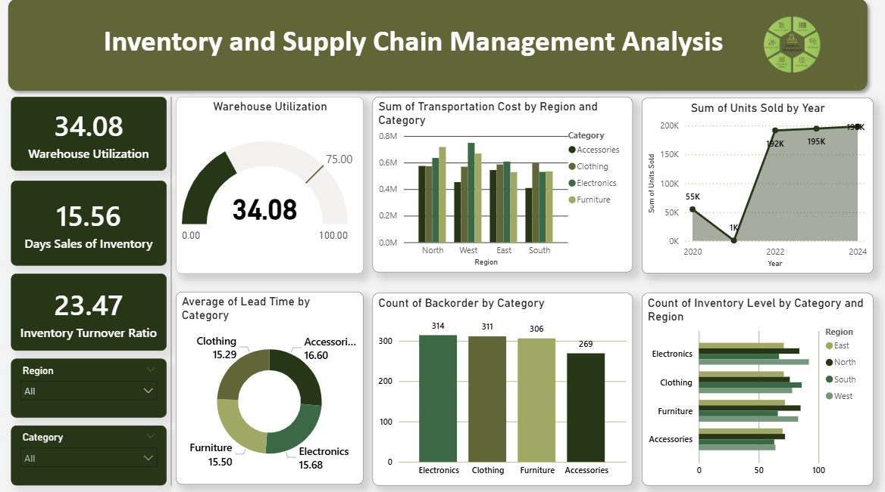

# Inventory-and-Supply-Chain-Dashboard
## Overview  
This dashboard analyzes inventory and supply chain performance across multiple regions and categories.
It tracks primary KPIs (efficiency and utilization) and secondary KPIs (costs, lead times, backorders, inventory distribution).

## Dashboard Demo  

## Primary KPI Insights – Inventory & Warehouse

1. Warehouse Utilization – 34.08%
Facility is under-utilized, indicating inefficient use of capital and space.

Solutions:

Right-size the warehouse to match demand.
Sub-lease unused space to reduce fixed costs.

2. Days Sales of Inventory (DSI) – 15.56 days
Inventory moves quickly, but capital is tied up for over two weeks.

Solutions:

Align procurement with sales velocity.
Improve cash flow by reducing excess holding.

3. Inventory Turnover Ratio – 23.47
High turnover indicates strong sales efficiency relative to stock levels.

Solutions:

Optimize reorder points to prevent stockouts.
Benchmark performance to maintain efficiency.

## Secondary KPI Insights – Supply Chain

1. Transportation Cost by Region & Category
West region accounts for ~47% of total transportation costs (~0.8M), which is 50% higher than North (~0.55M, ~32%) and nearly 4× higher than South (~0.2M, ~12%).

Solutions:

Optimize logistics routes.
Renegotiate carrier contracts.
Explore regional distribution centers.

2. Average Lead Time by Category
Accessories average 16.6 days, ~7% longer than Electronics (15.5) and ~5% longer than Clothing (15.8).

Solutions:

Negotiate shorter lead times with suppliers.
Diversify sourcing for Accessories.
Strengthen supply chain planning.

3. Backorders by Category
Electronics has 314 backorders (~28%), compared to Accessories (269, ~24%) and others (269–311).

Solutions:

Improve demand forecasting accuracy.
Increase safety stock for Electronics.
Enhance supplier responsiveness.

4. Inventory Levels by Category & Region
Accessories show the lowest inventory levels (~15–18% lower) than other categories across all regions.

Solutions:

Revise allocation policies.
Implement minimum stock thresholds.
Align inventory planning with regional sales.

## Tech Stack

Power Query – Data extraction, cleaning, and transformation.

Data Modeling – Establishing relationships across fact and dimension tables for accurate reporting.

DAX (Data Analysis Expressions) – Creating calculated measures and KPIs for deeper insights.

Power BI – Interactive dashboard development and visualization.

Data Source: Kaggle dataset (supply chain & warehouse data).

## Dashboard Features

Interactive slicers to filter by Region and Category.

Drill-downs for transportation cost, inventory levels, and backorder analysis.

Real-time KPI tracking for both primary and secondary metrics.

## Key Points

1. Warehouse utilization is critically low, requiring space optimization.

2. Transportation costs are heavily skewed toward the West region.

3. Accessories face both higher lead times and lower inventory levels, creating a double inefficiency.

4. Electronics category is most vulnerable due to high backorders.

## How to Use This Repo

1. Download the Repository

Clone or download this repo to local system.

2. Open the Dashboard

Open the .pbix file in Power BI Desktop.

3. Explore the Data

Use the Region and Category slicers to filter insights dynamically.

Drill down into transportation cost, lead time, inventory levels, and backorders.

4. View Static Insights

Dashboard.png is included in the folder for quick viewing.
